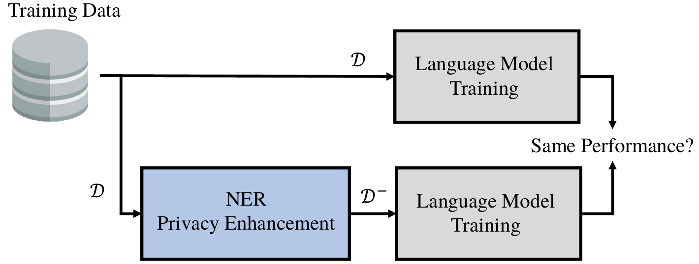

# PBa-LLM: Privacy- and Bias-aware NLP in General and Applied to AI-based Recruitment

**Gonzalo Mancera · Daniel DeAlcala · Julian Fierrez · Ruben Tolosana · Francisco Jurado · Alvaro Ortigosa · Aythami Morales**

*BiometricsAI, Universidad Autónoma de Madrid (UAM)*

---

## 📄 Overview

The advancement of Large Language Models (LLMs) has enabled powerful NLP applications, but it also raises serious concerns about personal data exposure and fairness in sensitive domains such as recruitment. **PBa-LLM** is a framework that uses Named Entity Recognition (NER) to anonymize sensitive information—names, locations, and organizations—before training or deploying language models, aiming to protect user privacy while preserving downstream task performance.

We evaluate **eight anonymization models** (specialized NER systems and general-purpose LLMs) across **six text classification datasets**, and apply the framework to a **bias-aware CV screening case study** on FairCVdb, showing that privacy-preserving preprocessing can be integrated into real-world recruitment pipelines without degrading task performance.

  
   
  <em>Fig. 1 — Graphical abstract: models are trained on original text (𝒟) and on NER-anonymized text (𝒟⁻) to compare performance.</em>

## 🔑 Key Contributions

- A NER-based anonymization pipeline that removes Person, Location, and Organization entities from text prior to LLM training, formalized as a comparability condition between models trained on original and anonymized data.
- A broad, controlled comparison of **eight anonymization systems** — Presidio, Flair, Stanza, NER-CoNLL2003-BERT, GPT-3.5, GPT-4 Mini, GPT-4 Nano, and DeepSeek-V3 — spanning both specialized NER architectures and general-purpose LLMs.
- Evaluation across **six diverse NLP datasets**: Sentiment140, DBPedia, BBC News, IMDB, Cyberbullying Classification, and News Category Dataset.
- A real-world case study on **AI-based blind recruitment** using FairCVdb, integrating anonymization with gender-neutral preprocessing to promote fairer candidate scoring.

## 🏗️ Framework

  
   
  <em>Fig. 2 — Privacy-aware training pipeline: text is anonymized by the NER module (N) before being passed to the downstream BERT-based classifier (M).</em>

## 💼 Case Study: Blind Recruitment

  
   
  <em>Fig. 3 — Recruitment case study: candidate resumes are anonymized before occupancy prediction and scoring, reducing reliance on personal and demographic information.</em>

## 📁 Repository Structure
