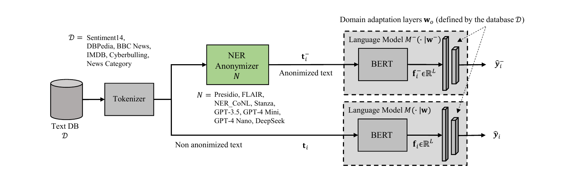
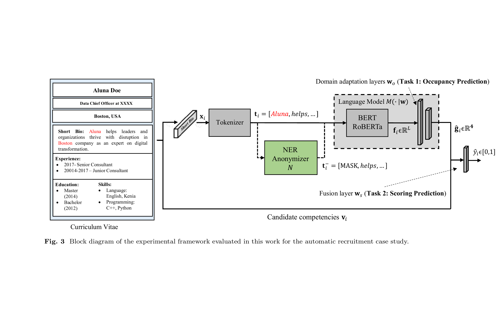

<div align="center">

# PBa-LLM: Privacy- and Bias-aware NLP in General and Applied to AI-based Recruitment

[](LICENSE)
[](https://www.python.org/)

**Gonzalo Mancera · Daniel DeAlcala · Julian Fierrez · Ruben Tolosana · Francisco Jurado · Alvaro Ortigosa · Aythami Morales**

*BiometricsAI, Universidad Autónoma de Madrid (UAM)*

</div>

---

## 📄 Overview

The advancement of Large Language Models (LLMs) has enabled powerful NLP applications, but it also raises serious concerns about personal data exposure and fairness in sensitive domains such as recruitment. **PBa-LLM** is a framework that uses Named Entity Recognition (NER) to anonymize sensitive information—names, locations, and organizations—before training or deploying language models, aiming to protect user privacy while preserving downstream task performance.

We evaluate **eight anonymization models** (specialized NER systems and general-purpose LLMs) across **six text classification datasets**, and apply the framework to a **bias-aware CV screening case study** on FairCVdb, showing that privacy-preserving preprocessing can be integrated into real-world recruitment pipelines without degrading task performance.

<p align="center">
  
  <br>
  <em>Fig. 1 — Graphical abstract: models are trained on original text (𝒟) and on NER-anonymized text (𝒟⁻) to compare performance.</em>
</p>

## 🔑 Key Contributions

- A NER-based anonymization pipeline that removes Person, Location, and Organization entities from text prior to LLM training, formalized as a comparability condition between models trained on original and anonymized data.
- A broad, controlled comparison of **eight anonymization systems** — Presidio, Flair, Stanza, NER-CoNLL2003-BERT, GPT-3.5, GPT-4 Mini, GPT-4 Nano, and DeepSeek-V3 — spanning both specialized NER architectures and general-purpose LLMs.
- Evaluation across **six diverse NLP datasets**: Sentiment140, DBPedia, BBC News, IMDB, Cyberbullying Classification, and News Category Dataset.
- A real-world case study on **AI-based blind recruitment** using FairCVdb, integrating anonymization with gender-neutral preprocessing to promote fairer candidate scoring.

## 🏗️ Framework

The core of PBa-LLM is a modular, model-agnostic pipeline in which an anonymization module (N) and a downstream language model (M) are fully interchangeable components. Raw text is first tokenized and passed through the NER anonymizer, which detects and masks Person, Location, and Organization entities, producing an anonymized version of the text. Both the original and anonymized text are then independently used to train a BERT-based classifier, allowing a direct comparison of downstream performance under the two conditions.

<p align="center">
  
  <br>
  <em>Fig. 2 — Privacy-aware training pipeline: text is anonymized by the NER module (N) before being passed to the downstream BERT-based classifier (M).</em>
</p>

## 💼 Case Study: Blind Recruitment

To demonstrate the practical value of the framework, PBa-LLM is applied to an AI-based recruitment scenario using the FairCVdb dataset. Candidate resumes are anonymized before being processed by the scoring system, removing personally identifiable information such as names and locations. This is combined with a gender-neutral preprocessing step that removes explicit and implicit gender indicators from free-text biographies, aiming to reduce the model's reliance on demographic proxies and produce more balanced candidate rankings.

<p align="center">
  
  <br>
  <em>Fig. 3 — Recruitment case study: candidate resumes are anonymized before occupancy prediction and scoring, reducing reliance on personal and demographic information.</em>
</p>

> **Dataset:** This case study uses **FairCVdb**, developed by our research group (BiDAlab) as a testbed for studying fairness and bias in multimodal automatic recruitment systems. The dataset and its accompanying benchmark are publicly available at [BiDAlab/FairCVtest](https://github.com/BiDAlab/FairCVtest), together with additional resources on multimodal bias analysis in AI-based hiring.

## 📁 Repository Structure

```
pba-llm/
├── text_privacy_impact/                  # Section 4: Table 1 experiments (6 datasets)
│   ├── anonymization/
│   │   ├── anonymize_presidio.py
│   │   ├── anonymize_flair.py
│   │   ├── anonymize_stanza.py
│   │   ├── anonymize_ner_conll2003_bert.py
│   │   ├── anonymize_gpt35.py
│   │   ├── anonymize_gpt4_mini.py
│   │   ├── anonymize_gpt4_nano.py
│   │   └── anonymize_deepseek.py
│   └── classification/
        └── cyber_classifier.py
        └── dbpedia_classifier.py
        └── imdb_classifier.py
        └── news_classifier.py
        └── twitter_classifier.py
│
├── recruitment_case_study/                # Section 5: FairCVdb experiments
│   ├── Anonymization/
        └── ChatGPT
            └── ChatGPTAnonimizarionCV.py
        └── DeepPavlov
            └── ChatGPTAnonimizarionCV.py
        └── Flair
            └── FlairAnonimizarionCV.py
        └── Presidio
            └── PresidioAnonimizationCV.py
        └── Stanza
            └── StanzaAnonimizationCV.py
        └── DeepSeek
            └── StanzaAnonimizationCVDeepseek.py
│   ├── bert_gender_classification.py
│   └── bert_score_pred.py
│
├── assets/
├── requirements.txt
├── .gitignore
├── LICENSE
└── README.md

```


## ⚙️ Installation


## 🚀 Usage


## 🔬 Reproducibility


## 📚 Citation

This work builds on a preliminary version presented at ICDAR 2025:

```bibtex
@inproceedings{mancera2025pba,
  title={PBa-LLM: Privacy-and bias-aware NLP using named-entity recognition (NER)},
  author={Mancera, Gonzalo and Morales, Aythami and Fierrez, Julian and Tolosana, Ruben and Pe{\~n}a, Alejandro and Lopez-Duran, Miguel and Jurado, Francisco and Ortigosa, Alvaro},
  booktitle={International Conference on Document Analysis and Recognition},
  pages={3--20},
  year={2025},
  organization={Springer}
}
```

## 🙏 Acknowledgments

This study has been supported by the projects M2RAI (PID2024-160053OB-I00, MICIU/FEDER) and Cátedra ENIA UAM-VERIDAS en IA Responsable (NextGenerationEU PRTR TSI-100927-2023-2). The work of G. Mancera is supported by FPI-PRE2022-104499 MICINN/FEDER. This work has been conducted within the ELLIS Unit Madrid.

## 📬 Contact

For questions about this work, please contact **gonzalo.mancera@uam.es** or open an issue in this repository.
